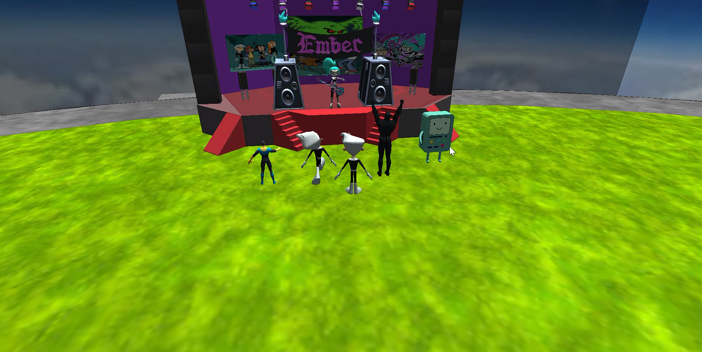
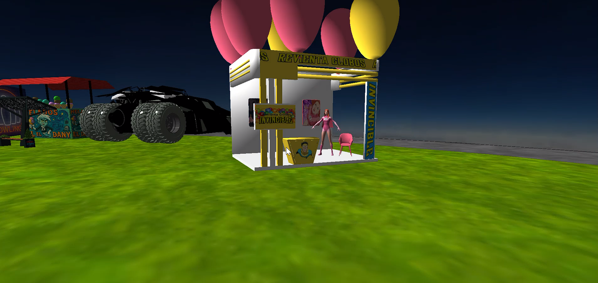
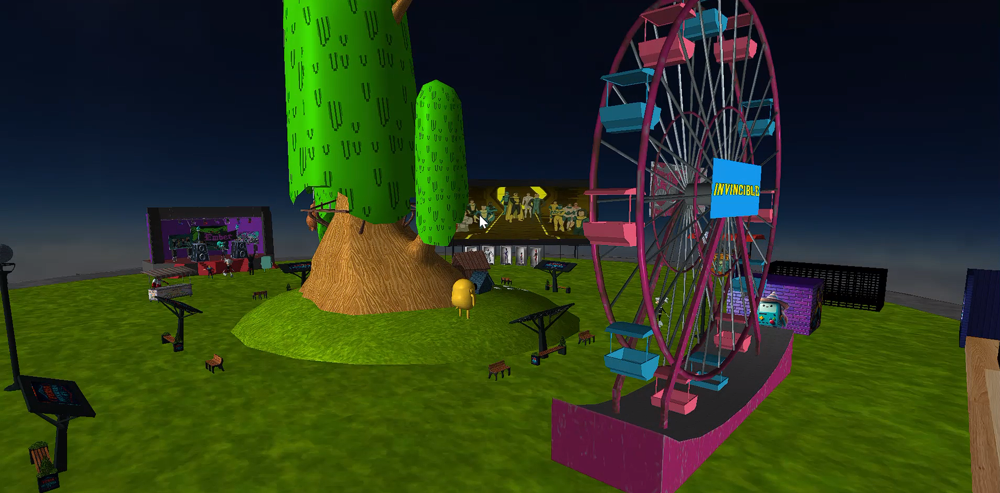

# mexican-futuristic-fair

Proyecto de computación Gráfica.

# Preview








Autores:
- BOLAÑOS GUERRERO JULIAN
- GUADARRAMA HERRERA KEN BRYAN
- LÓPEZ REYES ALAM
- MONTIEL AVILES AXEL FERNANDO

# Inicio Rápido
1. Clonar repositorio
```
git clone https://github.com/Blairi/mexican-futuristic-fair
```
2. Descargar archivos de carpeta OneDrive e incliurlos en la carpeta de la solución.

https://drive.google.com/file/d/11C0RBbOBfz0niOOcYJ6DuBwMjfsUIh4O/view?usp=sharing

3. Compilar y ejecutar.
